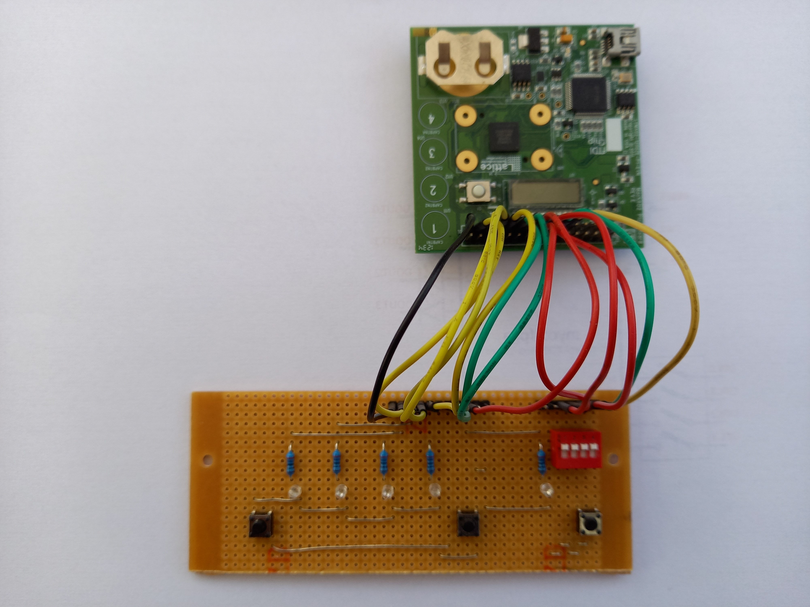
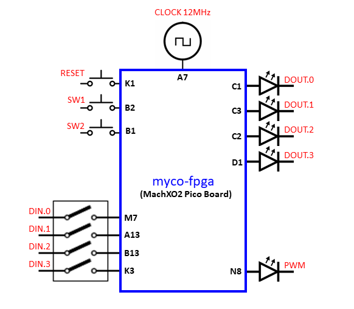

# myco-fpga
A 4-bit computer system for FPGAs  
myco-fpga is a FPGA implementation of the MyCo (My little Computer) system, also known in German as TPS (Tastenprogrammierbare Steuerung).

With this system you can enter, run and edit programs with just three pushbuttons and 4 LEDs. The system also includes 4 digital inputs, typically connected to a array of DIP switches and a PWM output which can connect to an LED. This FPGA version does not have the two ADC channels that are available on the microcontroller version of MyCo/TPS. This feature will be added in the future.  

To get you started, several demo programs are pre-loaded, selectable by the DIP switches. The demo programs can easily be modified or overwritten by your own programs.  

A video showing a basic demonstration is available  [here](https://www.youtube.com/watch?v=95f5JvLq4_Q&t=5s)

This is not a direct implementation of MyCo/TPS on an FPGA. It is a emulator, running on a pumpkin-cpu. The assembly language program for this emulator is in the file **myco.asm**. More information about the pumpkin-cpu core and be found [here](https://github.com/Steve-Teal/pumpkin-cpu)

## Installation

First you will need to find a FPGA evaluation board with at least 3 pushbuttons, 4 LEDS and a bank of 4 switches. The 4 switches are optional if you do not want to take advantage of the demo programs. I used a 'MachXO2 Pico Board' from Lattice Semiconductor wired to a small piece of stripboard with the necessary components on. This as an advantage of creating a layout that makes entering programs easier.  

Create a project with your FPGA tool and add all the VHDL files in this repo:

**myco.vhd**  
**myco_mem.vhd**  
**pumpkin.vhd**  
**timer.vhd**  
**pwm.vhd**  

If you're using a Pico Board and Lattice Diamond, you can use the **myco.lpf** file which contains all the pin assignments shown in the diagram below. The switch inputs all have pull-ups enabled and expect to be pulled down when the switches are activated. 

For other FPGAs, different pinning will be required. This project should build on most FPGA tool chains.

## ToDo

* 2 Channel ADC
* Program storage in external EEPROM

## MIT License

Copyright (c) 2020 Steve Teal

Permission is hereby granted, free of charge, to any person obtaining a copy
of this software and associated documentation files (the "Software"), to deal
in the Software without restriction, including without limitation the rights
to use, copy, modify, merge, publish, distribute, sublicense, and/or sell
copies of the Software, and to permit persons to whom the Software is
furnished to do so, subject to the following conditions:

The above copyright notice and this permission notice shall be included in all
copies or substantial portions of the Software.

THE SOFTWARE IS PROVIDED "AS IS", WITHOUT WARRANTY OF ANY KIND, EXPRESS OR
IMPLIED, INCLUDING BUT NOT LIMITED TO THE WARRANTIES OF MERCHANTABILITY,
FITNESS FOR A PARTICULAR PURPOSE AND NONINFRINGEMENT. IN NO EVENT SHALL THE
AUTHORS OR COPYRIGHT HOLDERS BE LIABLE FOR ANY CLAIM, DAMAGES OR OTHER
LIABILITY, WHETHER IN AN ACTION OF CONTRACT, TORT OR OTHERWISE, ARISING FROM,
OUT OF OR IN CONNECTION WITH THE SOFTWARE OR THE USE OR OTHER DEALINGS IN THE
SOFTWARE.

